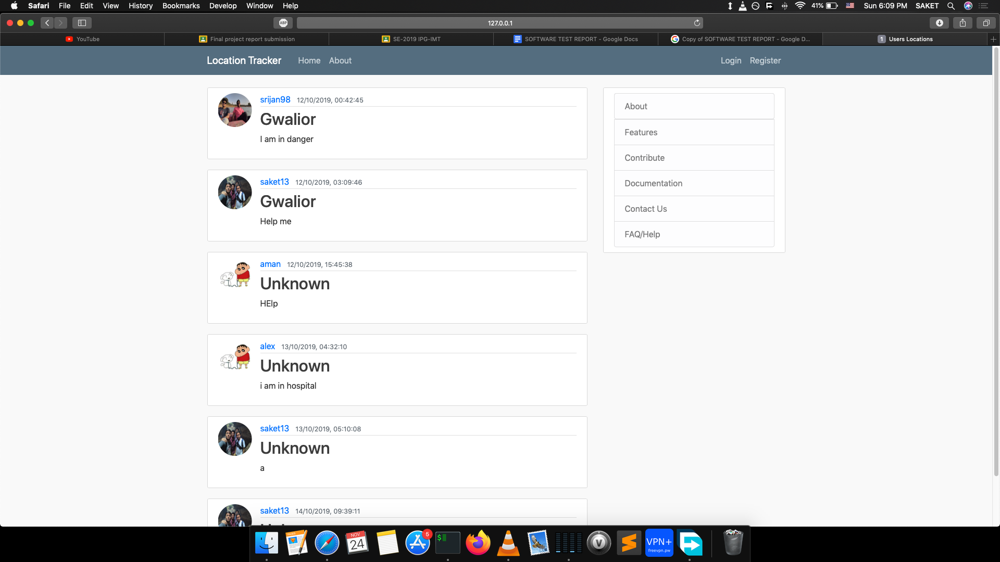
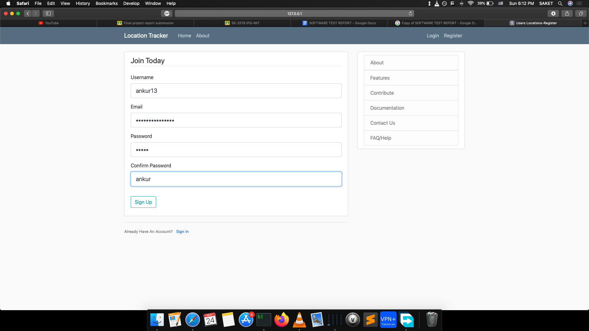
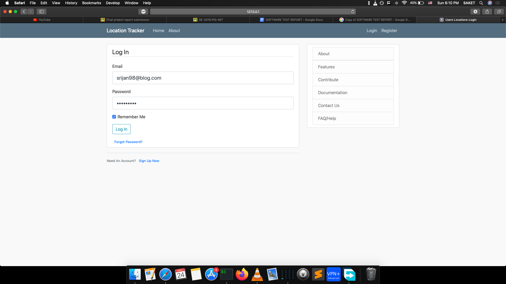
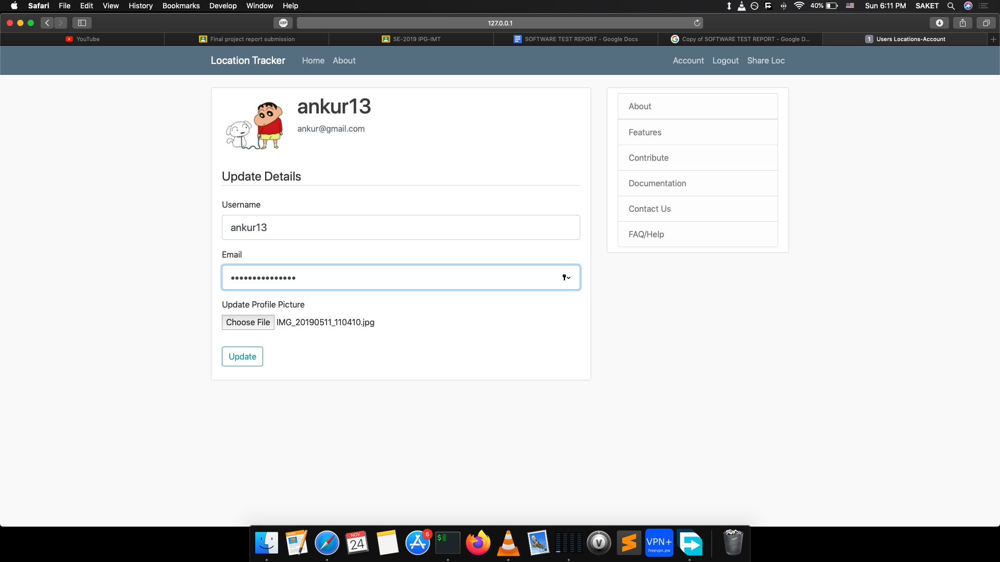
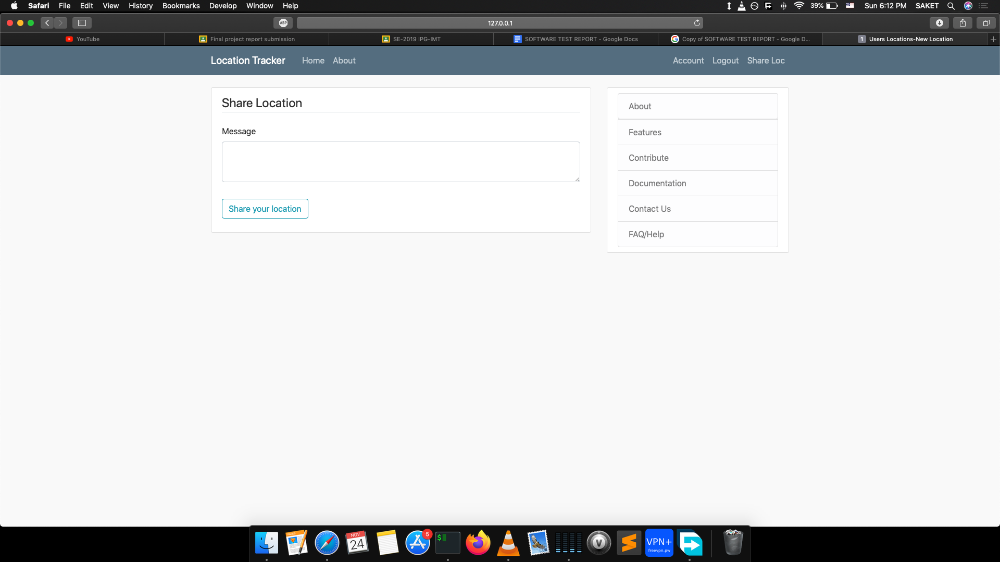

# Location Tracking System

This project was made by me as a part of the Software Engineering(SE) project in the academic curriculum.This software uses the 
IP address of the user to track location and all the other users registered can see the shared location along with the message
and the date and time of message logging.

## How It Looks Like

### HomePage

### Register

### Login

### Account 

### Share Location(With Msg)



## Getting Started

These instructions will get you a copy of the project up and running on your local machine for development and testing purposes. See deployment for notes on how to deploy the project on a live system.

### Prerequisites

Firstly,create a virtual environment in order to avoid any system wide python packages conflict with the project's environment
packages.On a UNIX based system(MacOS), this has been done accordingly:

```
cd Location-Tracker-System-master/
python3 -m venv <VirtualEnvName>      (VirtualEnvName is optional to use, there is already a virtual env named location)
source location/bin/activate
pip install -r requirements.txt       (Installs all the dependencies of the project)

```

### Installing

A step by step series of examples that tell you how to get the development environment running

Say what the step will be

``` 
cd Location-Tracker-System-master/
source location/bin/activate
cd loc_proj
python3 run.py

```

And repeat

```
source location/bin/activate
deactivate 

```

## Deployment

This project can be easily deployed on a live website by buying the domain and the server.

## Built With

* [Flask](https://palletsprojects.com/p/flask/) - The web framework used
* [Jinja](https://pypi.org/project/Jinja2//) - Template Engine for Flask
* [FlaskSQLAlchemy](https://flask-sqlalchemy.palletsprojects.com/en/2.x/) - Used as the database

## Contributing

Please read [CONTRIBUTING.md](https://gist.github.com/saket13) for details on our code of conduct, and the process for submitting pull requests to us.

## Versioning

We use [SemVer](http://semver.org/) for versioning. For the versions available, see the [tags on this repository](https://github.com/your/project/tags). 

## Authors

* **Saket Saumya** - *Initial work* - [saket13](https://github.com/saket13)

See also the list of [contributors](https://github.com/your/project/contributors) who participated in this project.

## License

This project is licensed under the MIT License - see the [LICENSE.md](LICENSE.md) file for details

## Acknowledgments

* To CoreyMS for his YouTube videos
* To MiguelGrinberg for his mega Flask tutorial
* To everyone who motivated me to do this project
